```js
// hello world
const fadil = {
  role: "Software Engineer",
  focus: "Backend· APIs · Data · AI/ML · Bioinformatics",
  location: "Jakarta, Indonesia 🇮🇩",
};
```

---

### 👤 About me

CS undergraduate at **BINUS University** with a year of production experience building backend systems at IDEMIA — a global identity tech company. I love designing clean APIs, optimising databases, and shipping things that actually work in the real world.

Currently strengthening my skills in **AI/ML applied to genomics** as preparation for a Master's in Bioinformatics / Computational Biology while keeping a strong foundation in software engineering.

📄 Published at **IEEE iSemantic 2024** · 🎓 GPA 3.44 · 🃏 Former pro esports player turned engineer

---

### 🛠 Tech stack


---

### 🚀 Featured projects

| Project | Stack | Highlights |
|---|---|---|
| 🧬 **TCGA-BRCA Cancer Classification** | End-to-end ML pipeline for Tumor vs Normal classification using real TCGA-BRCA RNA-seq data | • 99.59% accuracy & 0.9992 ROC-AUC, SHAP explainability on genomics data, High-dimensional biological data processing
| 🗂 **Test Card Management System** | Django · PostgreSQL · Jenkins | Asset lifecycle, LDAP auth, audit trails, CI/CD |
| ✈️ **AirClone** | Swift · SwiftUI | iOS booking app with auth, filters & reservations |
| 🗳 **Online Voting System** | PHP · SQL · JS | Secure full-stack voting platform, team lead |
---

### 📊 At a glance

| | |
|---|---|
| 💼 Production experience | 1 year @ IDEMIA |
| 🎓 Education | BSc Computer Science, BINUS University |
| 📄 Publications | IEEE iSemantic 2024 |
| 📜 Certifications | AWS Cloud, SQL (HackerRank), Data Analytics, Quantum Computing, Genomics |

---

### 📬 Reach me

- 📧 fadil.nugroho124@gmail.com
- 💼 [LinkedIn](https://linkedin.com/in/fadil-nugroho-788223274/)
- 📍 Jakarta, Indonesia

---
<p align="center">
  
</p>
<p align="center">
  <i>"Building apps, studying cells."</i>
</p>
